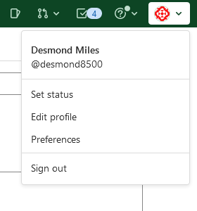
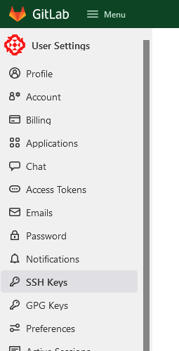
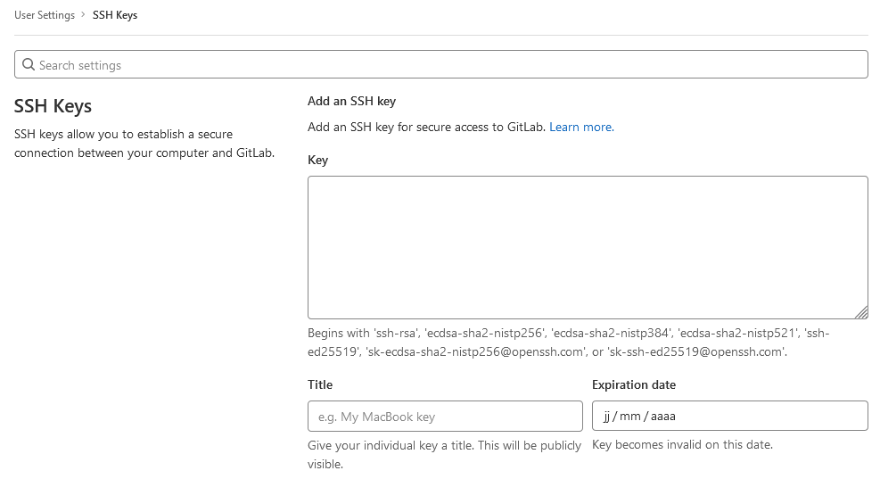

# Gitlab

## Ajouter une clé SSH

Pour pouvoir cloner des répos sur gitlab il faut ajouter une clé ssh au compte.  
Il faut dans un premier temps générer une clé.

1. Dans le terminal :

    ```bash
    ssh-keygen -t rsa
    ```

1. On vous demande de définir l'emplacement de la nouvelle clé, vous validez directement
1. On vous demande ensuite de définir un mot de passe, vous êtes libre de le laisser vide ou non
1. La clé est ensuite générée
1. IL faudra ensuite ouvrir le fichier `C:/Utilisateurs/votre_nom_d'utilisateur/.shh/id_rsa.pub` avec un bloc note et copier son contenu
1. Ouvrez ensuite votre compte gitlab, sur votre compte, préférences, puis clé shh
   
   
1. Vous mettez le contenu de la clé ssh dans le formulaire puis vous définissez la date d'expiration.
   
1. Lors du premier clonage de répo on vous demandera de lier votre clé locale à votre compte git, il faudra accepter

[Source](https://tutos.rezel.net/git/ssh-keys/)

## CI/CD

